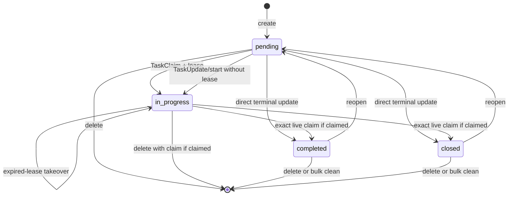
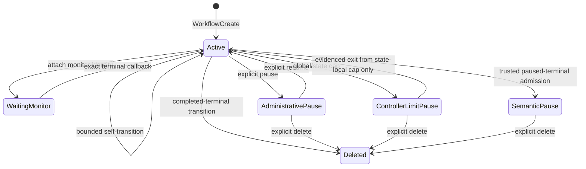
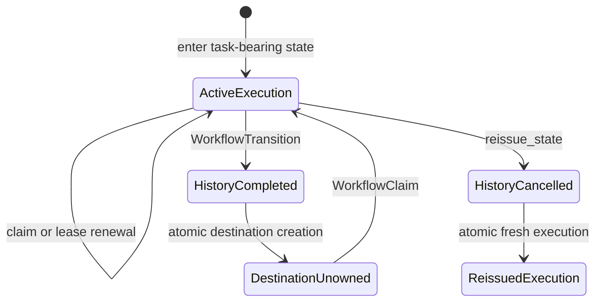
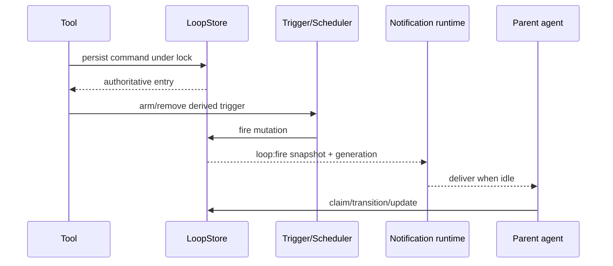
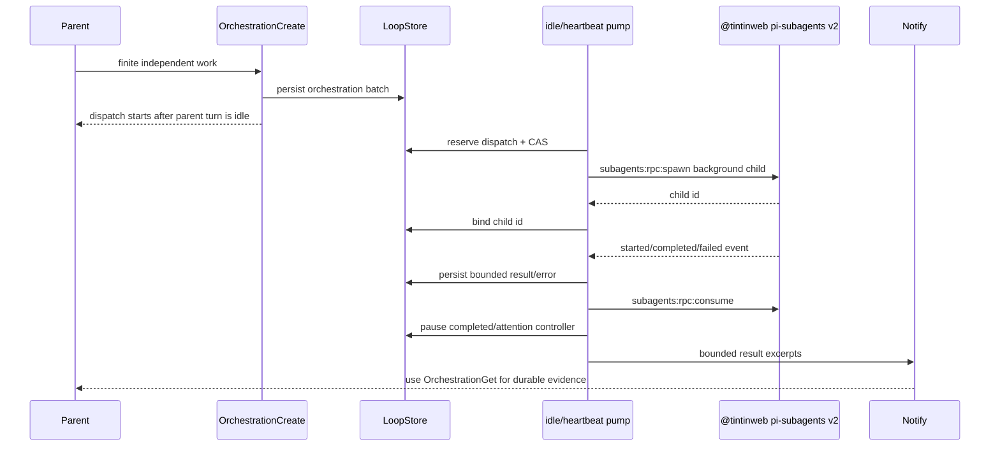

# pi-loop lifecycle architecture audit

**Target:** PR #74 head (`4f0e16b1c34d`) plus the installed `@tintinweb/pi-subagents` protocol-v2 provider (v0.19.0)

**Status:** architecture model and evidence-backed gap audit complete; no production fixes included

## 1. Authority topology

```mermaid
flowchart LR
  Agent[Parent Pi agent]
  NativeTools[Native task tools / tasks command]
  TaskRPC[Task RPC client/server]
  TaskStore[(TaskStore)]
  ExternalTasks[(external pi-tasks)]
  Backlog[Task-backlog LoopEntry]

  WorkflowTools[Workflow tools]
  LoopStore[(LoopStore)]
  Workflow[WorkflowRun]
  Exec[WorkflowExecutionRecord]
  Trigger[TriggerSystem / Scheduler]
  Notify[Notification runtime]
  Monitor[MonitorManager]

  Orch[Orchestration LoopEntry]
  Subagents[@tintinweb pi-subagents v2]
  Fleet[Widget / FleetView / conversation / transcript]

  Agent --> NativeTools
  NativeTools --> TaskStore
  Agent --> TaskRPC
  TaskRPC --> ExternalTasks
  TaskStore -. tasks:created and unfinished count .-> Backlog
  ExternalTasks -. task RPC and events .-> Backlog
  Backlog --> LoopStore
  Backlog -. wakes only; never owns tasks .-> Agent

  Agent --> WorkflowTools
  WorkflowTools --> LoopStore
  LoopStore --> Workflow
  Workflow --> Exec
  Trigger --> LoopStore
  LoopStore -. generation-fenced wake snapshot .-> Notify
  Notify --> Agent
  Monitor --> LoopStore

  Agent --> Orch
  Orch --> LoopStore
  LoopStore -. protocol-v2 spawn .-> Subagents
  Subagents -. lifecycle result .-> LoopStore
  Subagents --> Fleet
  LoopStore -. bounded parent wake .-> Notify

  TaskStore --x Workflow
  ExternalTasks --x Workflow
  Exec --x TaskRPC
  Workflow --x Orch
```

`--x` means the architecture forbids or does not implement the connection.

## 2. Entity ownership matrix

| Entity | Durable owner | Execution owner | Creation | Settlement | Cleanup | Agent-visible surface |
|---|---|---|---|---|---|---|
| Standalone native task | `TaskStore` | task claim holder | `TaskCreate`, `/tasks`, task RPC | `TaskUpdate completed/closed` | `TaskDelete`, bulk clean | `TaskList`, `TaskGet`, `/tasks`, widget summary |
| External standalone task | external `pi-tasks` | external provider claim holder | task RPC | task RPC | provider clean/delete | provider tools/RPC; pi-loop summary only |
| Task-backlog controller | `LoopStore` | parent Pi turn | `LoopCreate(taskBacklog=true)` | backlog becomes empty | automatic LoopStore deletion/tombstone | loop wake, `LoopList`, widget |
| Ordinary loop | `LoopStore` | parent Pi turn | `LoopCreate` | stop condition / explicit completion | delete or expiry retirement | loop wake, `LoopList`, widget |
| Workflow definition/run | `LoopStore` | session runtime + parent agent | `WorkflowCreate` | declared terminal outcome | completed terminal deletes; paused terminal persists | workflow wake, `LoopList`, `/loop`, widget |
| Embedded workflow execution | `LoopStore` | server-held execution lease | initial state or transition/reissue | atomic transition/reissue | history or controller deletion | workflow inspection; never TaskList |
| Monitor process | process-local `MonitorManager` | originating runtime | `MonitorCreate` | child process terminal | prune/stop/shutdown | monitor tools/widget/wake |
| Orchestration intent/work item | `LoopStore` | orchestration runtime/generation | `OrchestrationCreate` | lifecycle event persisted | explicit loop deletion/cancel | `OrchestrationGet`, bounded wake, widget counts |
| Subagent child | `@tintinweb/pi-subagents` | provider process/global queue | protocol-v2 spawn | provider lifecycle event | stop + consume | live widget/Fleet/conversation; pi-loop consumption suppresses the normal completion notification |

## 3. Standalone task state machine



### Task invariants

1. `TaskStore`/external `pi-tasks` exclusively owns standalone records.
2. At most one unexpired claim exists.
3. Terminal settlement clears the claim.
4. Lease expiry does not change `in_progress`; takeover is explicit.
5. Dependencies and handoff links are description conventions, not graph fields.
6. Backlog loops observe and wake for unfinished tasks but never transition them.
7. Workflow execution records never enter task RPC or TaskStore.

## 4. Workflow aggregate and execution state machine





### Workflow invariants

1. Definition, current state, executions, history, leases, evidence, pause provenance, and transition sequence are one `LoopStore` aggregate.
2. Transition settlement and destination creation occur in one locked snapshot.
3. Revision/state/sequence/execution identity fence stale mutations.
4. Initial task execution is leased to the creator; later task executions begin unowned.
5. Administrative pauses require explicit resume.
6. Completed terminal workflows are deleted; paused terminals remain inspectable.
7. Scheduler/trigger registrations, monitor processes, and queued notifications are derived/runtime state, not workflow authority.

## 5. Wake, monitor, and restart paths



- Pending notifications are memory-only and generation-fenced.
- Session recovery reloads durable stores, processes expiry, restores triggers, and adopts unfinished controllers.
- Monitor state is process-local; workflow stores only an exact waiting identity.
- Persisted task and workflow leases survive restart until expiry or takeover.

## 6. Existing pi-loop orchestration path



Consequences of the current model:

- `OrchestrationCreate` promises launch after the parent turn becomes idle, and `agent_end` is the normal pump. The 30-second heartbeat also pumps orchestration without checking parent-agent activity, so a long parent turn can start workers before it ends.
- Provider completion is consumed after pi-loop persists its bounded copy.
- Parent wake excerpts are capped; full persisted evidence requires `OrchestrationGet`.
- pi-loop renders counts, not provider-owned live transcripts.
- Orchestration entries cannot execute or settle workflow states.

## 7. Actual `@tintinweb/pi-subagents` integration

```mermaid
sequenceDiagram
  participant Parent
  participant Loop as pi-loop orchestration
  participant Provider as @tintinweb/pi-subagents
  participant UI as Widget / FleetView / transcript

  Parent->>Loop: OrchestrationCreate
  Loop->>Provider: protocol-v2 background spawn
  Provider->>UI: running agent activity and conversation
  Provider-->>Loop: completed/failed event with flat result
  Loop->>Loop: persist bounded result
  Loop->>Provider: consume(agentId)
  Provider--xParent: cancel/suppress native completion nudge
  Loop-->>Parent: capped orchestration wake
  Parent->>Loop: OrchestrationGet for persisted evidence
```

The packages are wire-compatible. The UX divergence comes from how pi-loop uses the provider’s supported ownership handoff:

| Concern | Provider-native behavior | pi-loop integration behavior |
|---|---|---|
| RPC | Protocol-v2 ping/spawn/stop/consume | Uses the same supported channels and reply envelopes |
| Running visibility | Widget, FleetView, live conversation | Running top-level RPC agents remain provider-visible |
| Completion | Styled notification with preview and expandable/full result path | pi-loop calls `consume`, which marks the result read and suppresses that notification |
| Durable evidence | Provider record/session/transcript while retained | LoopStore stores a separate bounded flat result/error copy |
| Recovery | In-memory top-level record plus persisted agent session where enabled | Protocol v2 exposes no status/join query, so pi-loop cannot reconcile an ambiguous dispatch after restart |
| Native orchestration | `SubagentWorkflow` provides deterministic agent/parallel/pipeline UI | `OrchestrationCreate` duplicates a smaller finite-batch controller in LoopStore |

## 8. Cross-machine invariants

| Boundary | Required invariant |
|---|---|
| Task ↔ workflow | No workflow settlement through `TaskUpdate`; no workflow projection into standalone tasks. |
| Task ↔ backlog loop | Loop observes aggregate unfinished work; task claims remain provider-owned. |
| Workflow ↔ trigger | Trigger is armed only while authoritative workflow state permits firing. |
| Workflow ↔ notification | Delivery must not instruct work for a deleted or superseded state/execution. |
| Workflow ↔ monitor | Exact wait identity fences callbacks; deleting workflow does not imply monitor ownership. |
| Orchestration ↔ subagent | Dispatch is persisted before spawn and terminal evidence before consume. |
| Workflow ↔ orchestration | No link currently exists; neither controller may silently settle the other. |
| pi-loop ↔ provider UI | Provider owns child transcript/progress; pi-loop should not claim equivalent observability from bounded copies. |
| Provider compatibility | Protocol version and completion-ownership semantics must be explicit; a successful ping alone does not provide status/join recovery. |

## 9. Audit coverage

The audit investigated the following candidates before recommending fixes; verified dispositions appear in Section 10:

1. Accepted but initially unreachable workflow states.
2. Same-generation stale queued workflow wakes after pause/delete/transition.
3. Monitor completion rearming or waking an expired workflow.
4. Paused/terminal workflow expiry occurring only during recovery.
5. State cadence count behavior after exit and re-entry.
6. Unbounded workflow execution history for multi-state cycles/reissues.
7. Workflow deletion leaving its attached monitor process alive.
8. Unleased standalone `in_progress` tasks and direct terminal settlement.
9. Live claim holders not protecting task detail edits.
10. Same-owner task claim renewal without bearer authentication.
11. Shutdown-retained standalone claims delaying takeover.
12. Bulk task prune without per-task lifecycle events.
13. Direct `TaskStore`/auto-task paths bypassing canonical event/backlog settlement.
14. No first-class task dependency, parent-goal, controller, or handoff links.
15. No workflow-execution ↔ subagent-run binding or atomic result admission.
16. Deferred orchestration spawn and immediate provider-result consumption causing poor result visibility.
17. Protocol v2 has no status/join/transcript RPC for restart and post-completion reconciliation.
18. Active-but-idle workflows indistinguishable from abandoned workflows.
19. Duplicate controller adoption remains possible because routing is prompt convention, not durable binding.

## 10. Verification results and ranked gap register

Behavioral probes were run against PR #74 head and removed afterward. The worktree remained clean. Four probes passed in the first run; the task probe initially used an incorrect `toMatchObject({claim: undefined})` assertion for an absent property, then passed after checking `active.claim` directly. This was a probe assertion error, not a product failure.

### P1 — Safety, liveness, and durability

| Finding | Status | Evidence | Consequence |
|---|---|---|---|
| Same-generation stale workflow wakes | Reproduced | Notification delivery checks generation but has no callback to re-read controller existence, state, definition revision, transition sequence, or execution ID (`src/runtime/notification-runtime.ts:347-407`). A queued workflow snapshot still delivered after simulated deletion/supersession. | Parent can receive instructions for deleted or replaced work. |
| Monitor completion can revive expired workflow work | Reproduced | Waiting monitors are excluded from scheduler expiry tracking. Completion clears the wait, rearms, and wakes whenever returned status is active, without checking `expiresAt` (`src/runtime/monitor-ondone-runtime.ts:130-140`); `LoopStore.fire` also has no expiry guard (`src/store.ts:276-289`). | Work may execute after the seven-day controller boundary. |
| Multi-state cycles grow execution history without a bound | Reproduced | A 100-transition A↔B task cycle produced 100 full history entries. Direct self-loops are bounded, but multi-state cycles need no `maxAttempts`; transition/reissue append history (`src/workflow-reducer.ts:237-262`, `src/workflow-revision.ts:426-456`). | Snapshot size and lock/write cost can grow indefinitely. |
| No provider status reconciliation after restart | Confirmed from source | pi-loop recovery pumps and converts expired-owned active dispatches to `uncertain`; `@tintinweb/pi-subagents` protocol v2 exposes ping/spawn/stop/consume but no status or join query (`@tintinweb/pi-subagents` `src/cross-extension-rpc.ts`). | Completed/running work can become permanently ambiguous after runtime loss. |
| Result schema and observability are lossy | Confirmed from source | The provider lifecycle event carries flat result/error, token counts, tool-use count, and duration but not transcript/session paths or live conversation metadata. Pi-loop persists a further bounded projection. | `OrchestrationGet` cannot reproduce provider-native conversation or transcript inspection. |
| No workflow-execution ↔ delegated-run identity | Confirmed from types | `WorkflowExecutionRecord` has no orchestration, dispatch, provider-run, artifact, or child-session reference; store creation forbids simultaneous workflow and orchestration state. | Agent completion cannot causally settle, annotate, or resume a workflow execution. |
| Result consumption suppresses provider completion | Confirmed against installed `@tintinweb/pi-subagents` 0.19 | pi-loop persists terminal evidence then calls `subagents:rpc:consume`. The provider sets `resultConsumed`, cancels its nudge, and skips completion notification (`@tintinweb/pi-subagents` 0.19 `src/index.ts:485-591,800-826` and `src/cross-extension-rpc.ts:192-195`). | Agent output is replaced by pi-loop’s capped wake and manual `OrchestrationGet` flow, matching the reported UX. |

### P2 — Contract integrity and orphan detection

| Finding | Status | Evidence | Consequence |
|---|---|---|---|
| Unreachable initial workflow states | Reproduced | Base validation checks keys and targets but not reachability; a definition containing an orphan state was accepted (`src/workflow-definition.ts`). Revision-added states receive stricter reachability/rejoin checks (`src/workflow-revision.ts:387-417`). | Dead workflow states can ship unnoticed. |
| Unleased `in_progress` task and direct settlement paths | Reproduced; existing tests show intentional compatibility | `TaskStore.start()` creates `in_progress` without a claim, and unclaimed pending/in-progress tasks can complete or close (`src/task-store.ts:130-184`). | Runtime behavior is weaker than model guidance requiring `TaskClaim`; abandoned work has no lease owner. |
| Claimed task details are mutable without bearer | Reproduced | `updateTask()` validates claims for lifecycle changes but reaches `updateDetails()` without claim validation (`src/runtime/task-mutations.ts:123-185`). | Another caller can alter the active owner’s instructions while the claim remains live. |
| Same-owner task renewal ignores a supplied replacement claim ID | Confirmed and explicitly tested as intended behavior | Same session/runtime identity renews the existing token (`src/task-store.ts:60-102`; `test/task-store.test.ts`). | Treat as policy, not a defect, unless in-process RPC identity spoofing enters the threat model. |
| Bulk prune lacks per-task deletion events | Confirmed from source | `TASKS_PRUNED` effects are swallowed by the default no-op store effect hook, and `cleanTasks()` emits no `tasks:deleted` events. | External lifecycle subscribers cannot reconcile deletions incrementally. |
| Task dependencies and controller links are prose only | Confirmed architecture limit | Task records have optional generic metadata but native model tools expose only subject/description; dependencies are description conventions. Backlog loops adopt the global unfinished count. | The system cannot detect orphan, duplicate, blocked, or cross-goal tasks structurally. |
| Multiple backlog loops can adopt the same global backlog | Confirmed from source | Every active `tasks:created` backlog loop is selected and woken against the same pending count (`src/runtime/task-backlog-runtime.ts:115-151`). | Claims prevent simultaneous ownership, but duplicate controller wakes and competing guidance remain possible. |
| Active-idle and abandoned workflows are indistinguishable | Confirmed presentation limit | Derived activity reports `idle` for unowned/expired/no-task execution states without an abandonment or needs-attention state (`src/ui/workflow-presentation.ts:34-75`). | Unused workflows remain durable until expiry or explicit inspection without a clear remediation signal. |
| Workflow deletion does not own monitor termination | Confirmed architecture boundary | Deleting LoopStore state makes the exact callback inert, but `MonitorManager` retains and runs the process until terminal, explicit stop, or session shutdown. | This is safe callback fencing but can leave unintended process work after controller deletion. |

### Pending lower-confidence checks

The following remain candidates rather than final defects:

- whether cumulative state cadence counts across exits are intentional; current code preserves them and may permit a fire before pausing an already-exhausted re-entered state;
- whether paused/terminal workflows must obey live-session seven-day retirement or intentionally remain inspectable until recovery;
- whether native auto-task creation’s event emission is sufficient replacement for canonical mutation-facade backlog settlement.

## 11. Subagent integration options

### Option A — Keep LoopStore batches and restore native output

- **LoopStore owns:** finite batch, local concurrency, attempts, dispatch identity, and settlement wake.
- **`@tintinweb/pi-subagents` owns:** execution, global capacity, live widget/Fleet/conversation, transcript, and native completion card.
- Stop calling `consume`, or consume only after pi-loop presents an equivalent full result surface.

This is the smallest UX correction, but an unsuppressed provider completion plus a pi-loop settlement wake can cost two parent turns. The notification-ownership contract must be chosen explicitly.

### Option B — Use `SubagentWorkflow` for multi-agent orchestration

Let `@tintinweb/pi-subagents` own fanout, pipelines, retries, live workflow cards, and result aggregation. Pi-loop workflows continue to wake the parent and own semantic phases; the parent launches `SubagentWorkflow`, reviews its surfaced result, then calls `WorkflowTransition`.

This removes the duplicate finite-batch state machine and gives the native UI immediately. It is parent-mediated rather than an automatic durable workflow-to-agent binding.

### Option C — Extend protocol v2 before automatic binding

If workflow states must launch agents automatically, first add provider-supported RPC capabilities for status/join, transcript or full-result retrieval, exact terminal observation, and optionally workflow launch. Then bind the provider run to the exact workflow execution. Without those capabilities, restart must remain `uncertain` and output ownership remains lossy.

## 12. Recommended authority split

For the reported workflow-agent use case, prefer provider-native orchestration and presentation rather than rebuilding them in pi-loop.

```mermaid
flowchart LR
  W[(LoopStore WorkflowExecutionRecord)]
  Wake[Generation and execution-fenced parent wake]
  P[@tintinweb Agent or SubagentWorkflow]
  F[Widget / FleetView / conversation / completion]
  R[Parent review]
  T[WorkflowTransition]

  W --> Wake
  Wake --> P
  P --> F
  F --> R
  R --> T
  T --> W
```

Authority rules:

1. **LoopStore remains sole workflow authority.** A provider result never directly changes workflow state.
2. **`@tintinweb/pi-subagents` owns worker execution and presentation.** Do not clone FleetView, conversations, transcripts, or workflow progress into LoopStore.
3. **Keep outcomes explicit.** Parent review or a separately admitted deterministic policy chooses `WorkflowTransition`; child prose is not parsed as authority.
4. **Do not suppress provider-native output by default.** If pi-loop consumes a result, its own notification must surface equivalent bounded evidence and a clear full-result retrieval path.
5. **Use `SubagentWorkflow` for fanout.** Do not mirror each child into a second LoopStore batch unless pi-loop-specific durable retry semantics are genuinely required.
6. **Automatic binding requires a stronger provider seam.** Any future binding must fence workflow ID, definition revision, current state, transition sequence, and execution ID, and must reconcile through provider status/join after restart.
7. **Stale completion is evidence, not authority.** A child that finishes after transition, reissue, pause, or delete cannot settle current work.

This split resolves the user-visible output problem while preserving the project’s core rule: workflow state and semantic transitions remain exclusively `LoopStore`-owned.

## 13. Prioritized regression and design plan

Keep each item in a focused branch/PR. Do not fold these fixes into PR #74.

### Phase 1 — Close current workflow safety gaps

1. **Wake relevance fencing**
   - RED: queue a workflow wake, then transition, reissue, pause, and delete before flush.
   - GREEN contract: delivery re-reads authority and matches workflow ID, definition revision, state, transition sequence, and execution ID; irrelevant notifications are dropped without acknowledging unrelated durable state.
2. **Expiry before monitor resume/fire**
   - RED: terminal monitor callback at and after `expiresAt`.
   - GREEN contract: expiry settlement occurs atomically before wait-clear/rearm/wake; no expired work executes.
3. **Bound execution history**
   - RED: large A↔B cycle and repeated reissue under file-backed persistence.
   - Decide an explicit retention contract: bounded recent records plus aggregate counts/digest, or a bounded append-only external history. Rejection must not corrupt the current execution.
4. **Definition reachability**
   - RED: unreachable state, closed nonterminal component, and no terminal route.
   - Decide whether every initial definition state must be reachable and whether every reachable nonterminal state must have a path to terminal/declared pause.

### Phase 2 — Align standalone task ownership contracts

1. Decide whether unleased `in_progress` and direct pending→terminal transitions remain supported compatibility paths. If yes, document them and stop telling agents the lease is universally required; if no, add migration-aware validation.
2. Require the live bearer for subject/description edits to claimed tasks, with idempotent same-value handling.
3. Define bulk-prune event semantics: per-task deletion events, one bounded prune event with IDs/count, or an explicit snapshot-invalidated event.
4. Do not add dependency graph fields casually. First define whether task links are provider-neutral wire fields or native-only metadata, and how external `pi-tasks` participates.

### Phase 3 — Simplify the `@tintinweb/pi-subagents` integration

1. Decide completion ownership before coding:
   - recommended for general fanout: use provider-owned `SubagentWorkflow` and remove/deprecate the duplicate pi-loop batch;
   - minimal correction: retain `OrchestrationCreate` but restore provider-native completion output or render an equivalent pi-loop result surface before consume.
2. RED integration scenarios must cover:
   - provider absent or wrong protocol version;
   - spawn reply before/after lifecycle event;
   - restart while running/completed, which must remain explicitly `uncertain` until a status/join capability exists;
   - stale completion after workflow transition/reissue/delete;
   - Fleet-visible running work and readable final output;
   - exactly one intentional parent completion path;
   - result truncation with a reliable full-result retrieval path.
3. If automatic workflow-state delegation is required, coordinate a protocol extension for status/join and full-result or transcript retrieval before adding `DelegatedExecutionRef`.
4. Keep a live harness pinned to the actual supported `@tintinweb/pi-subagents` package/version. Synthetic mocks are insufficient as the only conformance gate.

### Phase 4 — Orphan and abandonment observability

Add read-only diagnostics before automatic cleanup:

- workflow idle with no live lease, monitor, trigger, or delegated run;
- claimed task whose lease expired;
- unleased `in_progress` task;
- backlog loop competing with another active backlog loop;
- unreachable workflow state;
- monitor whose linked workflow no longer exists;
- delegated run whose binding is stale or missing;
- controller past expiry but not authoritatively retired.

Diagnostics must distinguish **orphaned**, **awaiting claim**, **waiting monitor**, **administratively paused**, **controller-limited**, and **intentionally inspectable terminal** states. Do not auto-delete evidence-bearing controllers merely because they are idle.

### Merge gates

For every state-machine change:

- RED→GREEN unit regression;
- file-backed restart/recovery test;
- rejection byte-preservation test where applicable;
- property test for transition/CAS invariants;
- relevant live provider scenario;
- Linux, Windows, Analyze, and CodeQL;
- full project merge gate from `docs/TESTING.md`.
